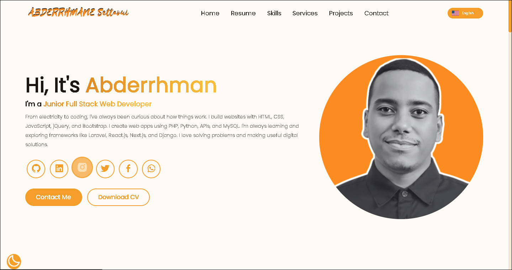

# Abderrhman Settaoui – Portfolio Site


---

## Preview


---

## Features
- Responsive and clean design
- Smooth animations and modern UI
- Project showcase with live demos
- Contact form for collaborations
- Hosted on GitHub Pages and Netlify

---

## Live Demo
- **GitHub Pages:** [View Site](https://abdarrhmanessetaoui.github.io/portfolio-site/)  
- **Netlify:** [View Site](https://abderrhmansettaoui.netlify.app/)

---

## Installation
```bash
git clone https://github.com/abdarrhmanessetaoui/portfolio-site.git
# Then open index.html in your browser
